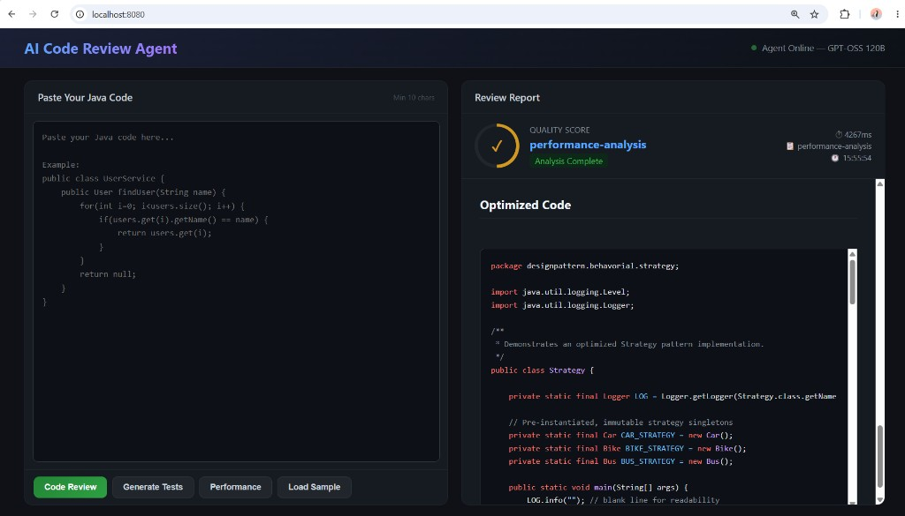

# Java AI Agent — Code Reviewer

### Spring Boot 3 + LangChain4j + Groq (Free LLM) + Web UI

---

## Overview

An AI-powered **Java Code Review Agent** that autonomously analyzes code using the **ReAct (Reason + Act) pattern**. It combines a Large Language Model (Groq/Llama) with local static analysis tools to provide intelligent, grounded code reviews via REST API and a built-in web dashboard.

The agent doesn't just call an LLM — it **thinks**, **decides which tools to call**, **observes results**, and **synthesizes** a structured review. This is the key difference between a simple LLM wrapper and an AI Agent.

---

## Architecture Flow

```
┌─────────────────────────────────────────────────────────────────┐
│                        Web UI (localhost:8080)                    │
│         Code Input → [Code Review] [Tests] [Performance]         │
└─────────────────────────────┬───────────────────────────────────┘
                              │ HTTP POST /api/agent/*
┌─────────────────────────────▼───────────────────────────────────┐
│                     AgentController (REST)                        │
│              Routes request to the correct agent method           │
└─────────────────────────────┬───────────────────────────────────┘
                              │
┌─────────────────────────────▼───────────────────────────────────┐
│               CodeReviewAgent (LangChain4j AiServices)           │
│                                                                   │
│   ┌─────────────────── ReAct Loop ──────────────────────┐        │
│   │  1. THINK  → What tools should I call?              │        │
│   │  2. ACT    → Call analyzeComplexity tool            │        │
│   │  3. OBSERVE → Read tool results                     │        │
│   │  4. THINK  → What else do I need?                   │        │
│   │  5. ACT    → Call detectCodeSmells tool             │        │
│   │  6. OBSERVE → Read tool results                     │        │
│   │  7. ACT    → Call checkSecurityVulnerabilities      │        │
│   │  8. OBSERVE → Read results                          │        │
│   │  9. SYNTHESIZE → Generate final review              │        │
│   └─────────────────────────────────────────────────────┘        │
└──────────┬──────────────────────────────────┬───────────────────┘
           │                                  │
┌──────────▼──────────┐          ┌────────────▼────────────────────┐
│  OpenAiChatModel    │          │       CodeReviewTools            │
│  (Groq LPU Cloud)   │          │                                  │
│                     │          │  • analyzeComplexity()            │
│  Model: GPT-OSS    │          │  • detectCodeSmells()             │
│  or Llama 3.3 70B  │          │  • checkSecurityVulnerabilities() │
│                     │          │  • suggestDesignPatterns()        │
└─────────────────────┘          └──────────────────────────────────┘
           │
┌──────────▼──────────┐
│ MessageWindowChat   │
│ Memory (20 msgs)    │
└─────────────────────┘
```

---

## Component Breakdown

### 1. `JavaAiAgentApplication.java` — Entry Point

Standard Spring Boot bootstrap. Starts the embedded Tomcat server on port 8080.

### 2. `AgentConfig.java` — Configuration & Wiring

Assembles the full agent stack:

- Creates `OpenAiChatModel` pointed at Groq's API (OpenAI-compatible endpoint)
- Registers `CodeReviewTools` as callable tools
- Sets up `MessageWindowChatMemory` (20-message sliding window)
- Builds the agent via `AiServices.builder()` — LangChain4j auto-generates the implementation

### 3. `CodeReviewAgent.java` — Agent Interface (3 Capabilities)

A declarative interface where each method has its own `@SystemMessage` persona:


| Method                 | Persona              | Output                                           |
| ---------------------- | -------------------- | ------------------------------------------------ |
| `reviewCode()`         | Senior Code Reviewer | Score, issues, smells, security, refactored code |
| `generateTests()`      | JUnit 5 Specialist   | Test strategy + complete test class              |
| `analyzePerformance()` | Performance Expert   | Issues, comparison table, optimized code         |


Each method enforces a strict output format with a mandatory **X/10 score**.

### 4. `CodeReviewTools.java` — 4 Static Analysis Tools

Local heuristic-based analyzers the LLM calls autonomously during the ReAct loop:


| Tool                           | What It Detects                                                            |
| ------------------------------ | -------------------------------------------------------------------------- |
| `analyzeComplexity`            | Cyclomatic complexity, method count, risk level                            |
| `detectCodeSmells`             | Long methods, magic numbers, poor naming, god class, raw types, System.out |
| `checkSecurityVulnerabilities` | SQL injection, hardcoded creds, MD5/SHA-1, insecure Random, XXE            |
| `suggestDesignPatterns`        | Builder, Factory, Strategy, Observer, Singleton anti-pattern               |


These tools run locally (no external dependencies) using regex/keyword matching.

### 5. `AgentController.java` — REST API

Exposes 4 HTTP endpoints with validation, error handling, and timing:


| Endpoint                    | Method | Description                                |
| --------------------------- | ------ | ------------------------------------------ |
| `/api/agent/review`         | POST   | Full code review with score                |
| `/api/agent/generate-tests` | POST   | JUnit 5 test generation                    |
| `/api/agent/performance`    | POST   | Performance analysis with comparison table |
| `/api/agent/health`         | GET    | Health check & registered tools            |


### 6. `index.html` — Web Dashboard

A single-page UI served from `src/main/resources/static/`:

- Split-panel layout (code input + report output)
- Circular score gauge (color-coded: green/yellow/red)
- Syntax-highlighted code blocks
- Markdown table rendering
- Loading state with spinner
- Error display

### 7. `samples/` — Test Input Files

Pre-built Java files with intentional issues for testing:


| File                              | Issues                                                   |
| --------------------------------- | -------------------------------------------------------- |
| `1_code_smells.java`              | God method, magic numbers, raw types, hardcoded DB creds |
| `2_design_patterns_needed.java`   | Strategy, Observer, Factory patterns needed              |
| `3_security_vulnerabilities.java` | SQL injection, MD5, insecure Random, XXE                 |
| `4_performance_issues.java`       | N+1 queries, unbounded cache, String concat in loop      |
| `5_small_security.java`           | Compact version for rate-limited testing                 |


---

## Quick Start

### Step 1 — Get Free Groq API Key

1. Go to **[https://console.groq.com](https://console.groq.com)**
2. Sign up (free, no credit card)
3. Click API Keys → Create API Key
4. Copy your key (starts with `gsk_...`)

### Step 2 — Set Environment Variable

**Windows PowerShell:**

```powershell
$env:GROQ_API_KEY="gsk_your_key_here"
```

**Mac / Linux:**

```bash
export GROQ_API_KEY=gsk_your_key_here
```

### Step 3 — Run

```bash
mvn spring-boot:run
```

App starts at: **[http://localhost:8080](http://localhost:8080)**

> **Note (Corporate Networks):** If you get SSL errors, run with:
>
> ```bash
> mvn spring-boot:run -Dspring-boot.run.jvmArguments="-Djavax.net.ssl.trustStoreType=Windows-ROOT"
> ```

---

## Usage

### Web UI

Open [http://localhost:8080](http://localhost:8080) in your browser:

1. Paste Java code (or click **Load Sample**)
2. Click one of three buttons:
  - **Code Review** — Quality score, smells, security, refactored code
  - **Generate Tests** — JUnit 5 test class with coverage score
  - **Performance** — Optimization analysis with comparison table
3. View the formatted report with score badge

### Web UI Screenshot



*The dashboard shows a split-panel layout: paste code on the left, get a formatted AI review on the right with syntax-highlighted optimized code, score card, and performance metrics.*

### REST API (curl)

```bash
# Code Review
curl -X POST http://localhost:8080/api/agent/review \
  -H "Content-Type: application/json" \
  -d '{"code": "public class UserService { ... }"}'

# Generate Tests
curl -X POST http://localhost:8080/api/agent/generate-tests \
  -H "Content-Type: application/json" \
  -d '{"code": "public int divide(int a, int b) { return a / b; }"}'

# Performance Analysis
curl -X POST http://localhost:8080/api/agent/performance \
  -H "Content-Type: application/json" \
  -d '{"code": "for(Long id : ids) { orders.addAll(repo.findByUserId(id)); }"}'

# Health Check
curl http://localhost:8080/api/agent/health
```

---

## Project Structure

```
java-ai-agent/
├── src/main/java/com/sanket/agent/
│   ├── JavaAiAgentApplication.java       ← Spring Boot entry point
│   ├── config/
│   │   └── AgentConfig.java              ← Wires LLM + Tools + Memory → Agent
│   ├── service/
│   │   └── CodeReviewAgent.java          ← AI Agent interface (3 methods)
│   ├── tools/
│   │   └── CodeReviewTools.java          ← 4 @Tool static analyzers
│   ├── controller/
│   │   └── AgentController.java          ← REST API endpoints
│   └── model/
│       ├── AgentRequest.java             ← Request DTO (code + context)
│       └── AgentResponse.java            ← Response DTO (status, result, time)
├── src/main/resources/
│   ├── application.yml                   ← Groq config (model, tokens, timeout)
│   └── static/
│       └── index.html                    ← Web dashboard UI
├── src/test/
│   └── CodeReviewToolsTest.java          ← Unit tests for tools
├── samples/                              ← Sample Java files for testing
├── .env.example                          ← Environment variable template
├── .gitignore
├── pom.xml                               ← Maven dependencies
└── README.md
```

---

## Tech Stack


| Layer            | Technology                                   |
| ---------------- | -------------------------------------------- |
| Language         | Java 17+                                     |
| Framework        | Spring Boot 3.2.5                            |
| AI Orchestration | LangChain4j 0.36.2                           |
| LLM Provider     | Groq (Free tier, no credit card)             |
| LLM Models       | GPT-OSS 120B / Llama 3.3 70B / Llama 4 Scout |
| Agent Pattern    | ReAct (Reason + Act)                         |
| Memory           | MessageWindowChatMemory (20 messages)        |
| Frontend         | Vanilla HTML/CSS/JS + highlight.js           |
| Testing          | JUnit 5                                      |
| Build            | Maven                                        |


---

## How the ReAct Agent Pattern Works

Unlike a simple "send code to LLM and get response" approach, this agent:

1. **Reasons** about what information it needs
2. **Acts** by calling tools (complexity, smells, security analyzers)
3. **Observes** the tool output
4. **Repeats** until it has enough information
5. **Synthesizes** a final structured review

This means the LLM's review is **grounded in actual static analysis results**, not just hallucinated observations.

```
Traditional Approach (Simple LLM Wrapper):
┌──────┐      ┌──────┐      ┌────────┐
│ Code │ ───► │ LLM  │ ───► │ Review │   (No grounding, may hallucinate)
└──────┘      └──────┘      └────────┘

Agent Approach (ReAct Pattern - This Project):
┌──────┐      ┌──────────────────────────────────────────────────┐      ┌────────┐
│      │      │  LLM Agent (ReAct Loop)                          │      │        │
│      │      │                                                  │      │        │
│      │      │  ┌─────────┐    ┌──────────────────────┐         │      │        │
│      │      │  │  THINK  │───►│ Call analyzeComplexity│──┐     │      │        │
│      │      │  └─────────┘    └──────────────────────┘  │      │      │        │
│      │      │       ▲                                   ▼      │      │        │
│ Code │ ───► │  ┌────┴────┐    ┌──────────────────────┐         │ ───► │ Review │
│      │      │  │ OBSERVE │◄───│ Call detectCodeSmells │──┐     │      │        │
│      │      │  └─────────┘    └──────────────────────┘  │      │      │        │
│      │      │       ▲                                   ▼      │      │        │
│      │      │  ┌────┴────┐    ┌──────────────────────┐         │      │        │
│      │      │  │ OBSERVE │◄───│ Call checkSecurity    │        │      │        │
│      │      │  └─────────┘    └──────────────────────┘         │      │        │
│      │      │       │                                          │      │        │
│      │      │       ▼                                          │      │        │
│      │      │  ┌────────────┐                                  │      │        │
│      │      │  │ SYNTHESIZE │  (Grounded in tool results)      │      │        │
│      │      │  └────────────┘                                  │      │        │
└──────┘      └──────────────────────────────────────────────────┘      └────────┘
```

---

## Groq Free Tier Limits


| Model                        | TPM    | Daily Tokens | Quality             |
| ---------------------------- | ------ | ------------ | ------------------- |
| llama-3.3-70b-versatile      | 12,000 | 100,000      | Best quality        |
| openai/gpt-oss-120b          | 8,000  | 200,000      | GPT-class           |
| meta-llama/llama-4-scout-17b | 30,000 | 500,000      | Good, may repeat    |
| llama-3.1-8b-instant         | 6,000  | 500,000      | Fast, lower quality |


Switch models in `application.yml` → `agent.groq.model`.

---

## Running on Another Machine

```bash
# 1. Clone
git clone https://github.com/your-username/java-ai-agent.git
cd java-ai-agent

# 2. Set API key
export GROQ_API_KEY=gsk_your_key_here

# 3. Run
mvn spring-boot:run

# 4. Open browser
# http://localhost:8080
```

No paid APIs, no credit card, no Docker — just Java 17+ and Maven.

---

*Built by Sanket Joshi — Senior Java Engineer | AI Agent Developer*